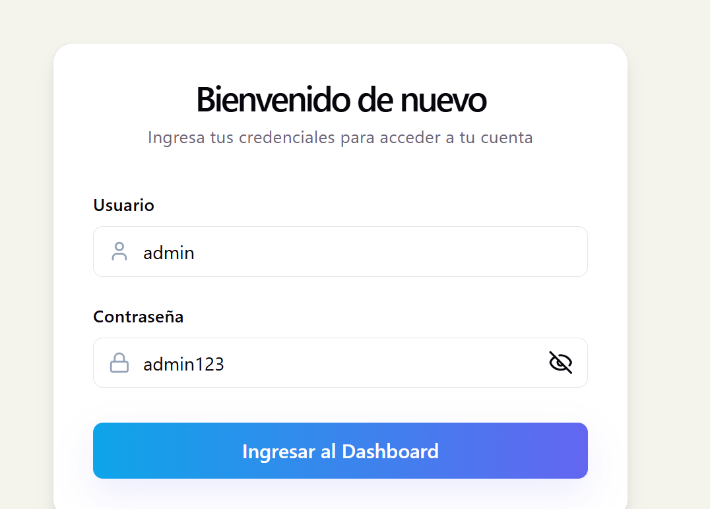
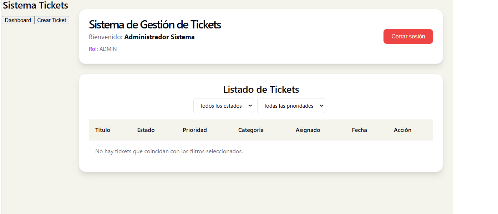
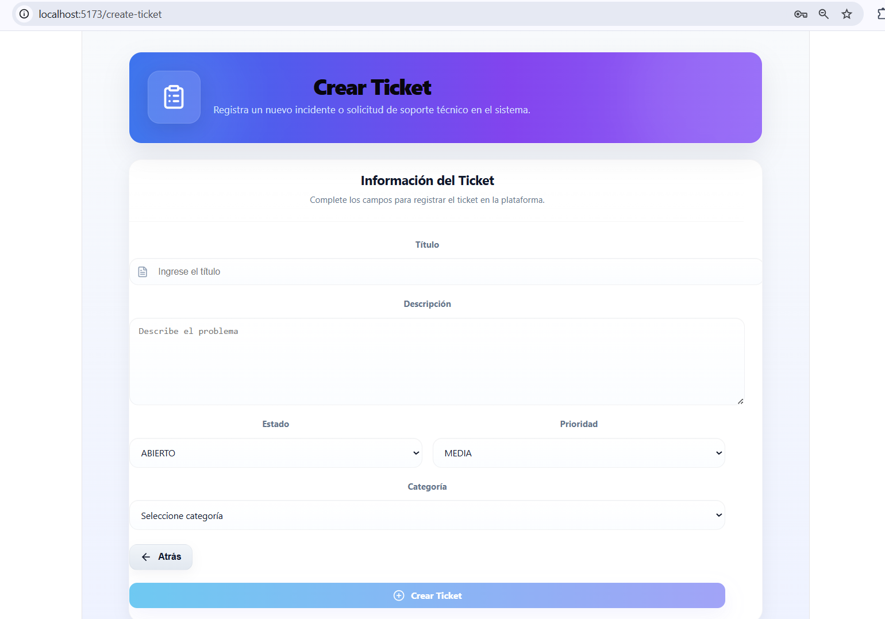
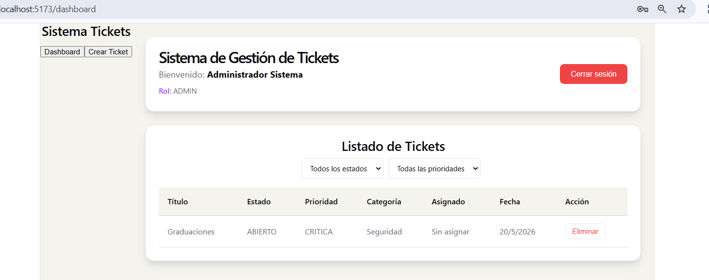

# Sistema de Tickets - Frontend React

## 🚀 Commit 1 - Login con JWT y protección de rutas
- Implementación de pantalla de login
- Consumo del endpoint de autenticación
- Almacenamiento del token en localStorage
- Protección de rutas con PrivateRoute
- Contexto de autenticación (AuthContext)

---

## 📋 Commit 2 - Listado de tickets con filtros
- Vista de tickets en tabla/cards
- Consumo de API GET tickets
- Filtros por estado, prioridad y categoría
- Integración con contexto de tickets

---

## 📝 Commit 3 - Crear ticket
- Formulario para creación de tickets
- Validación de campos
- Envío POST al backend
- Actualización del listado después de crear ticket

---

## 🛡️ Commit 4 - Mejoras en UX y Eliminación
- Implementación de mensajes de error
- Lógica de borrado con confirmación

